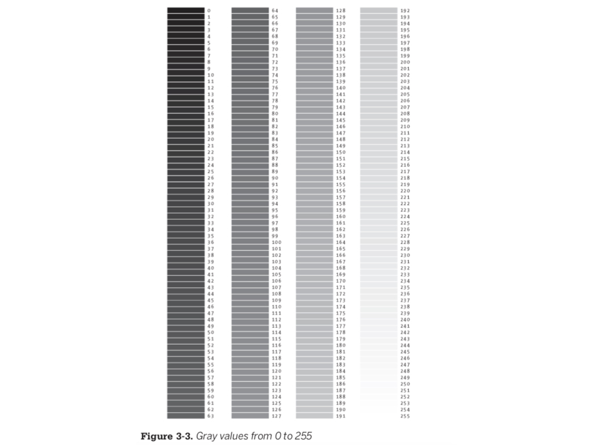
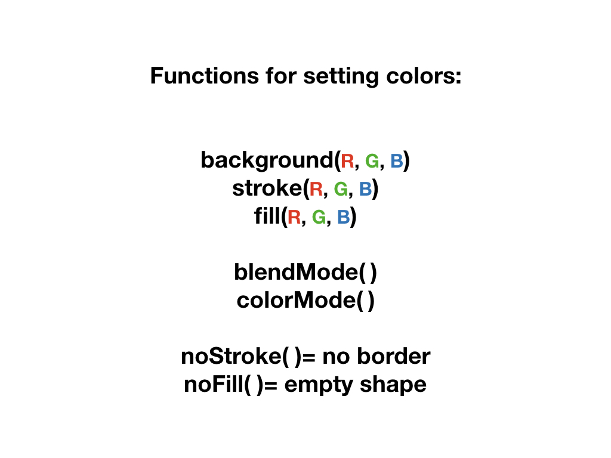

# **INTRO TO P5 & CODING- COMPLEX SHAPES & COLOR!**

#### **On this page:**
1. [Grayscale](#grayscale)
2. [Complex and Custom Shapes](#complex-and-custom-shapes)
3. [Color](#color)
4. [Transparency](#transparency)
5. [CSS Hex Codes](#css-hex-codes)

# Grayscale

# Complex and Custom Shapes

# Color

# Transparency

# CSS Hex Codes

# Next tutorial: [Interactivity](https://github.com/katerhoades/p5_interactivity/)

# Reference Resource
## [Full library of code references at p5js.org/reference](https://p5js.org/reference/)

#### **Other Resources:**
* [p5js.org](https://p5js.org/)
* [p5js.org Code Reference Library](https://p5js.org/reference)
* [Coding Train YouTube Channel- p5](https://www.youtube.com/playlist?list=PLRqwX-V7Uu6Zy51Q-x9tMWIv9cueOFTFA)
* [w3Schools Color Picker](https://www.w3schools.com/colors/colors_picker.asp)
 
